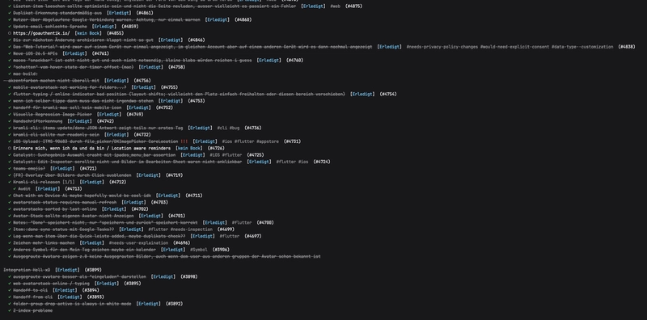

<p align="center">
  
</p>

<h1 align="center">homebrew-tap</h1>

<p align="center">
  Install the <a href="https://github.com/SpotlightForBugs/kramli-cli">Kramli CLI</a> with Homebrew on macOS and Linux.
</p>

<p align="center">
  
</p>

<p align="center">
  
</p>

## Install

```bash
brew install SpotlightForBugs/tap/kramli
```

## Quick start

```bash
kramli login
kramli lists list
kramli items list <LIST_ID> --open
```

Create an API key at [kramli.de/settings#api-keys](https://kramli.de/settings#api-keys) if you prefer `kramli login --api-key`.

Other install options (install script, Windows, manual download): [kramli-cli](https://github.com/SpotlightForBugs/kramli-cli).
